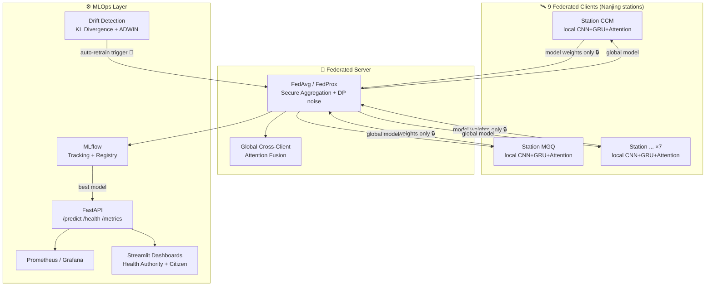
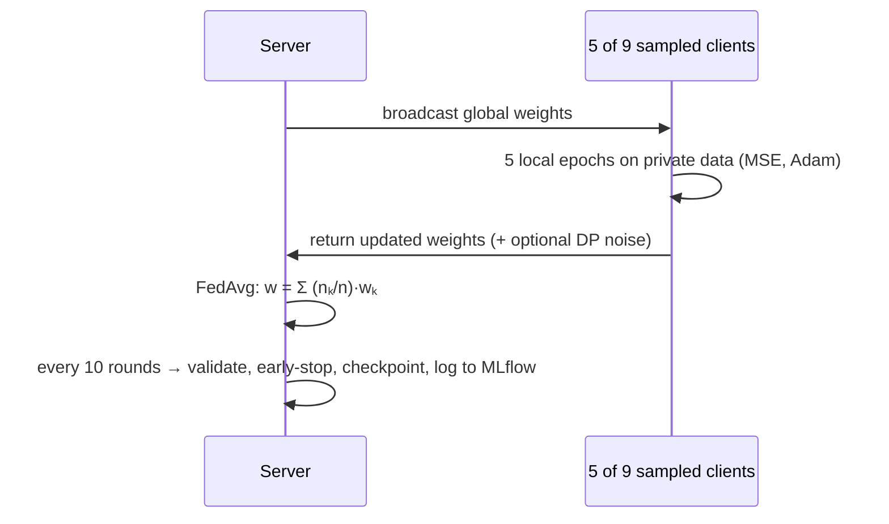
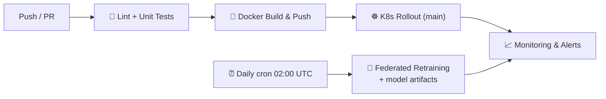

<div align="center">

# 🌍 FedHealth — Federated MLOps Platform

### Privacy-Preserving Air Quality Forecasting with Federated Deep Learning

*Forecasting PM2.5 pollution 24 hours ahead across 9 monitoring stations — without any station ever sharing its raw data.*

[](https://www.python.org/)
[](https://pytorch.org/)
[](https://fastapi.tiangolo.com/)
[](https://mlflow.org/)
[](https://www.docker.com/)
[](https://kubernetes.io/)
[](.github/workflows/mlops_ci_cd.yaml)
[](LICENSE)

</div>

---

## 💡 Why This Project?

Air pollution kills ~7 million people a year, and accurate short-term forecasts let health authorities act *before* dangerous spikes. But monitoring stations often belong to different agencies that **cannot pool their raw data**.

**FedHealth** solves this with **federated learning**: each station trains a deep spatiotemporal model on its own local data, and a central server aggregates **only the model weights** (FedAvg / FedProx). The data never moves — the model does.

Around that core, this repo implements a **complete MLOps lifecycle**: experiment tracking, model registry, containerized serving, drift detection with automatic retraining triggers, Prometheus monitoring, live dashboards, Kubernetes deployment, and a CI/CD pipeline with scheduled continuous training.

> Implements the methodology of *"FedAIR: Federated Air Quality Forecasting via Cross-Client Self-Attention and Spatiotemporal Modeling."*

---

## 🏗️ System Architecture



### Federated Training Round



---

## 🧠 Model: Spatiotemporal Forecaster (~500K params)

| Stage | Layer | Purpose |
|---|---|---|
| 1 | **1D CNN ×3** (32→64→128, k=3, BatchNorm, Dropout) | Extract local temporal patterns across the 24-h window |
| 2 | **GRU ×2** (hidden 128) | Model long-range temporal dependencies |
| 3 | **Multi-Head Self-Attention** (8 heads, residual + LayerNorm) | Re-weight which past hours matter most |
| 4 | **MLP head** (128→64→24) | Direct multi-step forecast: next **24 hourly PM2.5 values** |

**Input** `(batch, 24 h, 52 features)` → **Output** `(batch, 24 h forecast)`

Features per timestep: 7 pollutants (PM2.5, PM10, NO2, O3, CO, SO2, AQI) + 11 temporal features (incl. cyclical sin/cos hour/day/month) + 35 lag features (1/3/6/12/24 h shifts), scaled **per station** to preserve local distributions.

---

## ⚙️ MLOps Features

| Capability | Implementation |
|---|---|
| 🔬 Experiment tracking | MLflow — params/metrics per round, model registry (`FedAIR_Global_Model`), graceful file-based fallback |
| 📦 Serving | FastAPI + Pydantic validation, in-memory model cache, Swagger docs |
| 📈 Monitoring | Latency p95, prediction history, alerting endpoint, Prometheus exposition format |
| 🌊 Drift detection | **KL divergence** (data drift) + **ADWIN** (concept drift) → automatic retraining trigger |
| 🔒 Privacy | Secure aggregation (simulated) + optional **differential privacy** (Gaussian noise, ε=1.0) |
| 🐳 Containerization | Slim Docker image with `HEALTHCHECK`, uvicorn entrypoint |
| ☸️ Orchestration | K8s namespace, 3-replica API + 2-replica dashboard, liveness/readiness probes, PVCs, LoadBalancer services |
| 🔁 CI/CD + CT | GitHub Actions: lint+test → Docker build/push → **daily scheduled federated retraining (cron)** → K8s rollout → monitoring hooks |
| 📊 Dashboards | Streamlit: Health-Authority view (heatmaps, risk scores, forecasts, alerts) & Citizen view (personal alerts, trends, recommendations) |

---

## 📁 Project Structure

```
├── data_ingestion/        # Node simulator (9 federated clients) + streaming ingestion
├── data_preprocessing/    # Missing-value handling, per-node scaling, feature engineering, sequence builder
├── models/                # FedAIR client (CNN+GRU+Attention) & server (FedAvg/FedProx + attention fusion)
├── fed_learning/          # Federated trainer, secure aggregator, differential privacy
├── training/              # End-to-end training orchestrator (ingest → preprocess → rounds → eval)
├── monitoring/            # FastAPI serving/monitoring API + drift detectors (KL, ADWIN)
├── dashboard/             # Streamlit dashboards (health authority + citizen)
├── mlops_pipeline/
│   ├── docker/            # Dockerfile (serving image)
│   └── k8s/               # Kubernetes deployment manifests
├── .github/workflows/     # CI/CD + scheduled continuous-training pipeline
├── tests/                 # Unit tests (model shapes, aggregation)
└── utils/                 # Centralized config + logging
```

---

## 🚀 Quick Start

### 1. Clone & install

```bash
git clone https://github.com/alihashim786/FedHealth-federated-MLOps-platform.git
cd FedHealth-federated-MLOps-platform
pip install -r requirements.txt
```

### 2. Get the dataset (free, ~4 MB)

**Hourly Air Pollution Data — Nanjing (9 Stations)** from [Mendeley Data](https://data.mendeley.com/datasets/kvgwcrbjm3/1):

```bash
# Download and extract so you have: data/pollutant/{CCM,MGQ,OTZX,PK,RJL,SXL,XLDXC,XWH,ZHM}.csv
curl -L -o pollutant.rar "https://data.mendeley.com/public-files/datasets/kvgwcrbjm3/files/d246d894-5f54-4962-ad4c-47a8f1474a35/file_downloaded"
mkdir -p data && tar -xf pollutant.rar -C data    # or extract with WinRAR/7-Zip into data/
```

> Custom location? Set the `FEDAIR_DATA_ROOT` environment variable.

### 3. Smoke test

```bash
python run_quick_test.py    # verifies data → preprocessing → model → federated components
```

### 4. Train federated model

```bash
python run_training.py      # 5 demo rounds; set num_rounds=100 in utils/config.py for full training
```

Outputs: `models/global_model_round_*.pth`, `outputs/training_curve.png`, MLflow run in `mlruns/`.

### 5. Serve, monitor, visualize

```bash
# Inference + monitoring API  →  http://localhost:8000/docs
python -m uvicorn monitoring.monitor_api:app --port 8000

# Experiment tracking UI      →  http://localhost:5000
mlflow ui --port 5000

# Dashboards                  →  http://localhost:8501
streamlit run dashboard/health_dashboard.py
streamlit run dashboard/citizen_dashboard.py
```

### 6. Example prediction request

```bash
curl -X POST http://localhost:8000/predict \
  -H "Content-Type: application/json" \
  -d '{"station": "CCM", "features": [[/* 24 rows × 52 features */]]}'
```

---

## 🐳 Docker & ☸️ Kubernetes

```bash
# Docker
docker build -t fedair-server -f mlops_pipeline/docker/Dockerfile .
docker run -p 8000:8000 fedair-server

# Kubernetes
kubectl apply -f mlops_pipeline/k8s/deployment.yaml
kubectl get pods -n fedair
```

---

## 🔄 CI/CD Pipeline



---

## 🧪 Tests

```bash
pytest tests/ -v
```

---

## 📚 References

- **Paper:** *FedAIR: Federated Air Quality Forecasting via Cross-Client Self-Attention and Spatiotemporal Modeling*
- **FedAvg:** McMahan et al., *Communication-Efficient Learning of Deep Networks from Decentralized Data* (AISTATS 2017)
- **FedProx:** Li et al., *Federated Optimization in Heterogeneous Networks* (MLSys 2020)
- **Dataset:** [Hourly Air Pollution Data — Nanjing (9 Stations), Mendeley Data](https://data.mendeley.com/datasets/kvgwcrbjm3/1)

---

## 👤 Author

**Muhammad Ali Hashim** — AI Engineer (LLM Applications · RAG · MLOps)

[](https://github.com/alihashim786)
[](mailto:muhammadalihashim514@gmail.com)

---

<div align="center">

⭐ *If this project helped you understand federated learning or MLOps, consider giving it a star!*

</div>
